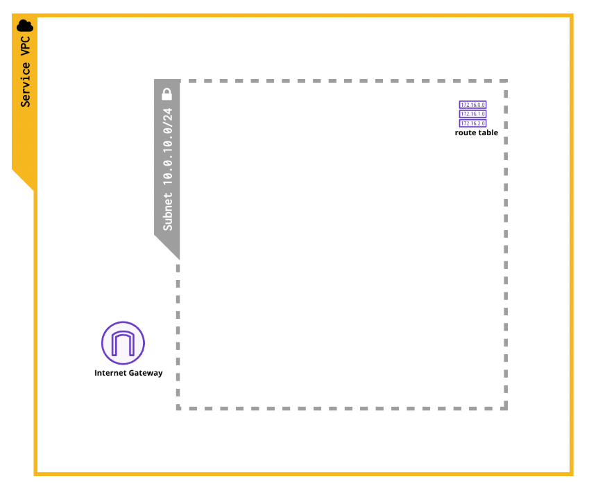

# ACloudGuru 초기설정 Terraform 코드

## 파일 및 인프라 구성설명

```bash
.
├── key_pair.tf         # EC2 접속용 공개키 정의
├── main.tf             # Main 인프라 설정용 파일 (empty)
├── network.tf          # VPC, Subnet, IGW등 기본 네트워크 인프라
├── provider.tf         # Terraform AWS Provider 정의
├── security_group.tf   # 보안그룹
├── userdata.sh         # EC2 작성시 사용할 userdata
└── variables.tf        # 초기설정에 필요한 각종 변수들 작성
```

### terraform apply 이후 작성되는 인프라 구성도



## 적용 순서

- 본 패키지는 ACloudGuru Plus 플랜을 이용할 경우 이용할 수 있는 플레이그라운드 (AWS 인프라 놀이터)를 이용함에 있어서 Terraform으로 초기 네트워크를 간단하게 구축할 수 있도록 돕기 위해 작성되었습니다.
- 기본적으로 서비스에 필요한 EC2나 다른 인프라를 제외하고 VPC와 Subnet등의 기본적인 부분만 작성하도록 되어 있고, 필요한 경우 `[main.tf](http://main.tf)` 파일이나 직접 HCL을 작성해서 추가하면 될듯 합니다.
